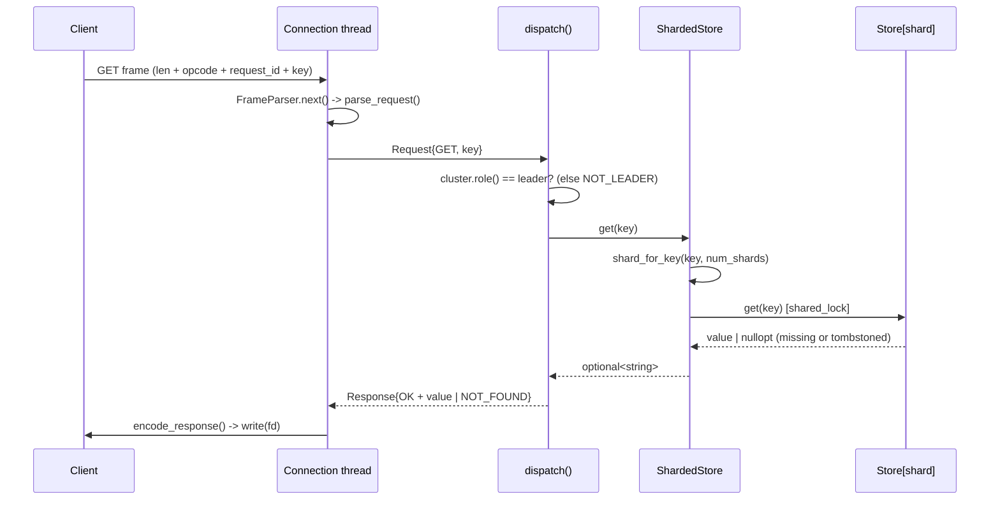
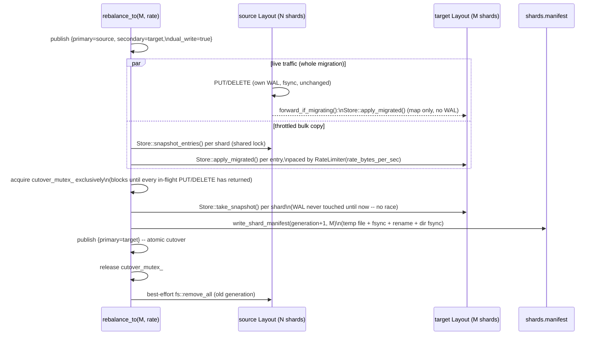
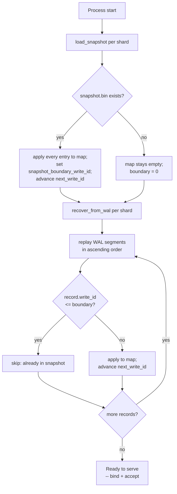

# Architecture

## Summary

A thread-per-connection, in-memory key-value store served over a custom
length-prefixed binary TCP protocol, supporting PUT/GET/DELETE, sharded
across N independent Store+WAL instances by a hash of the key, each with a
write-ahead log giving crash durability (fsync-per-write, replayed on
startup) and point-in-time snapshots that bound how much of that log a
restart has to replay. Each shard can be replicated from one leader node to
one or more follower nodes over the same wire protocol (op-log shipping,
asynchronous acks, WAL/snapshot-backed catch-up after a disconnect) — see
"Replication" below. As of stage 7, a cluster with peers configured also
runs heartbeat-based failover: a follower is promoted (with an epoch bump)
if the leader goes silent, and a stale leader that reappears is told to
step down — see "Failover" below. As of stage 9, the shard count itself can
be changed online (`ShardedStore::rebalance_to()`): a throttled background
copy into a freshly hashed layout, live writes forwarded for the duration,
then one atomic routing cutover, with no client-visible downtime — see
"Rebalancing" below. This is in-process resharding (shard count N -> M
within one process), not cross-node shard placement — see
`docs/limitations.md` for what that still doesn't cover.

## System Diagram

Current state: one server process, one thread per active connection, N
shards. `TcpServer::run()` accepts connections in a loop on its own thread
and spawns a new `std::thread` per accepted connection; each connection
thread runs the same read → parse → dispatch → write loop to completion
independently of every other connection. All connection threads share one
`ShardedStore`, which owns N `Store` instances — each with its own
`std::shared_mutex` and its own `WriteAheadLog` (see
`docs/design-decisions.md`'s "Sharding" section). `dispatch()` calls
`ShardedStore::put/get/del`, which hashes the request's key
(`shard_for_key()`, `sharding.h`) and calls straight through to that one
shard's `Store` — every PUT/DELETE is appended and fsynced to that shard's
WAL before `dispatch()` builds the response the connection thread writes
back to the client.

```
                        ┌──────────────────────────────────────────────────────┐
                        │                    kvstore_server                    │
                        │                                                      │
                        │  TcpServer::run()  (accept-loop thread)              │
  TCP client A ───────► │    accept() ──► spawn thread ──┐                     │
  TCP client B ───────► │    accept() ──► spawn thread ──┼─┐                   │
   (each its own        │    accept() ──► spawn thread ──┼─┼─┐                 │
   connection)          │                                ▼ ▼ ▼                 │
                        │                     serve_connection(fd) × N         │
                        │                     (one thread per connection)      │
                        │                                │                     │
                        │                                ▼                     │
                        │              FrameParser (protocol/)                 │
                        │              feed(bytes) / next(Frame)               │
                        │                                │                     │
                        │                                ▼                     │
                        │              parse_request(Frame)                    │
                        │                                │                     │
                        │                                ▼                     │
                        │              dispatch(ShardedStore&, Request)        │
                        │                                │                     │
                        │                                ▼                     │
                        │              shard_for_key(key, num_shards)          │
                        │           ┌────────────┬────────────┬────────────┐   │
                        │           ▼            ▼            ▼            ▼   │
                        │        shard 0      shard 1      shard 2  ...  shard N-1
                        │        Store +      Store +      Store +      Store +
                        │        shared_mutex shared_mutex shared_mutex shared_mutex
                        │        WAL(shard_0) WAL(shard_1) WAL(shard_2) WAL(shard_N-1)
                        │           │            │            │            │   │
                        │           └────────────┴─────┬──────┴────────────┘   │
                        │                                │                     │
                        │                                ▼                     │
                        │              Response ──► encode_response            │
                        │                                │                     │
  TCP client  ◄──────── │                                ▼ write(fd)           │
                        └──────────────────────────────────────────────────────┘
```

- `network/` owns the socket loop, per-connection thread spawning, and
  `dispatch()` — the only code that touches both `protocol/` and the store.
- `protocol/` knows nothing about sockets or the store; it only turns bytes
  into `Request`/`Frame` structs and back. `FrameParser` is not shared across
  threads — each connection thread owns its own instance.
- `sharding.h`/`sharded_store.h` own routing: `shard_for_key()` hashes a key
  to a shard id (FNV-1a — see docs/design-decisions.md for why not
  `std::hash`), and `ShardedStore` owns one `Store` + `WriteAheadLog` pair
  per shard, each in its own subdirectory (`<wal_dir>/shard_<i>`,
  `<snapshot_dir>/shard_<i>`). `ShardMap` names shard→node ownership
  (trivially "local" for every shard today — single-node, no cluster
  membership yet).
- `storage/` (`store.h`/`.cpp`) is completely unchanged by sharding: it
  knows nothing about sockets, the wire format, or that more than one
  `Store` instance might exist — it's still just an in-memory map guarded
  by one `std::shared_mutex`, plus a pointer to the `WriteAheadLog` it
  appends to.
- `wal/` and `snapshot/` are also unchanged by sharding — each already took
  a directory parameter scoped to one instance, so sharding is "construct N
  of them, each pointed at its own subdirectory," not a rewrite.

**Shutdown:** `stop()` closes the listening socket (unblocking `accept()`)
and calls `shutdown()` on every currently-active connection socket
(unblocking any thread parked in a blocking `read()`/`write()`). `run()`
waits for all connection threads to finish before returning, so a caller
doing `stop(); thread.join();` never observes a request still in flight.

As of stage 5, `snapshot/` gives `Store::take_snapshot()` a way to freeze
the live map to disk and `Store::load_snapshot()` +
`Store::recover_from_wal()` a way to restore from it — see "Snapshots and
Recovery" below for the format and flow, and `docs/limitations.md` for what
still isn't automated (there's no live trigger for taking one yet).

## Request Paths

The two hot paths a client actually exercises, end to end. Both run entirely
on one connection thread (see the System Diagram above) — nothing here hops
threads or queues.

### Read path (GET)

A GET never touches disk or the WAL: it takes only the target shard's
*shared* lock and reads the in-memory map. On a follower it's rejected
outright (`NOT_LEADER`) rather than served stale — see "Replication".



### Write path (PUT / DELETE)

A write is acknowledged only after its record is fsynced to that shard's WAL
— the durability point (`docs/design-decisions.md`'s "Fsync Policy"). During
a rebalance the same call also forwards the resulting entry to the target
layout; outside one, `forward_if_migrating()` is a single atomic-load check
that returns immediately.

```mermaid
sequenceDiagram
    participant C as Client
    participant Conn as Connection thread
    participant D as dispatch()
    participant SS as ShardedStore
    participant St as Store[shard]
    participant W as WAL[shard]

    C->>Conn: PUT frame (len + opcode + request_id + key_len + key + value)
    Conn->>Conn: FrameParser.next() -> parse_request()
    Conn->>D: Request{PUT, key, value}
    D->>D: cluster.role() == leader? (else NOT_LEADER)
    D->>SS: put(key, value)
    SS->>SS: shared_lock(cutover_mutex_); shard_for_key(key)
    SS->>St: put(key, value) [unique_lock]
    St->>W: append_put(...) + fsync
    W-->>St: durable (record on disk)
    St->>St: update map (value, version, write_id)
    St-->>SS: PutResult::kOk
    SS->>SS: forward_if_migrating() (no-op unless a rebalance is live)
    SS-->>D: PutResult
    D-->>Conn: Response{OK | BAD_REQUEST}
    Conn->>C: encode_response() -> write(fd)
```

## Sharding

`ShardedStore` (`sharded_store.h`/`.cpp`) owns `num_shards` independent
shards. Given `wal_dir`/`snapshot_dir` (the same two directory arguments
`main.cpp` already took pre-sharding) and `num_shards` (a new third/fourth
CLI argument, default 8 — see `kDefaultNumShards` in `main.cpp`), shard `i`
gets:

```
<wal_dir>/shard_<i>/        -- that shard's WriteAheadLog segments
<snapshot_dir>/shard_<i>/   -- that shard's snapshot.bin
```

Routing (`sharding.h`):

```
shard_id = fnv1a_hash(key) % num_shards
```

`ShardedStore::put/get/del/peek` each compute this once per call and
dispatch straight to that shard's `Store` — see docs/design-decisions.md's
"Sharding" section for hash- vs. range-partitioning rationale and why
FNV-1a rather than `std::hash<std::string>`.

**Startup recovery** runs per shard, in the same order `Store` already
required (snapshot load, then WAL replay), just once per shard:

```
ShardedStore::load_snapshots()      // for i in 0..num_shards: Store[i].load_snapshot(...)
        │
        ▼
ShardedStore::recover_from_wal()    // for i in 0..num_shards: Store[i].recover_from_wal()
```

Each shard's `Store`/`WriteAheadLog` pair is fully independent: a corrupt or
missing shard's data has no way to reach another shard's map, lock, or
files, since they're different objects pointed at different directories
(`tests/sharding_test.cpp` has a test that corrupts one shard's WAL segment
and confirms every other shard still recovers correctly).

**Shard-to-node ownership:** `ShardMap` (also in `sharding.h`) records which
node owns each shard. Today, with one node, `owning_node(shard_id)` always
returns `"local"` — there is no cluster membership, node discovery, or
cross-node shard migration (see docs/limitations.md). This exists now only
to name the seam a later clustering phase would extend; stage 9's
rebalancing (below) changes `num_shards` online but every shard is still
led by this one process.

## Rebalancing

Stage 9: `ShardedStore::rebalance_to(new_num_shards, rate_bytes_per_sec)`
changes the shard count online — no restart, no client-visible downtime.
This is in-process resharding (N shards -> M shards, within one process),
not cross-node shard placement: see docs/design-decisions.md's "Online
Resharding" section for why that scope was chosen over migrating shards
between nodes, and docs/limitations.md for what that still leaves out.

### Routing during a migration

`ShardedStore` routes every PUT/GET/DELETE through one `shared_ptr<RoutingPlan>`,
read via `atomic_load`/published via `atomic_store` — one atomic pointer
load per request, no mutex, on the non-migrating hot path:

```mermaid
stateDiagram-v2
    [*] --> Idle
    Idle --> Migrating: rebalance_to(M) called\npublish {primary=source, secondary=target, dual_write=true}
    Migrating --> Migrating: throttled copy loop\n(Store::snapshot_entries -> Store::apply_migrated)\nlive PUT/DELETE forwarded to target
    Migrating --> Cutover: copy loop finishes
    Cutover --> Done: hold cutover_mutex_ exclusively:\ntarget.take_snapshot()\nwrite_shard_manifest()\npublish {primary=target}
    Done --> [*]
```

- **Idle/Done** — `{primary=active, secondary=null, dual_write=false}`:
  routing identical to pre-stage-9 `ShardedStore`.
- **Migrating** — `{primary=source, secondary=target, dual_write=true}`:
  PUT/DELETE acknowledge from `source` (unchanged durability contract) and
  then forward the resulting entry into `target` via
  `Store::apply_migrated()` (bypasses the WAL — see below). GET/peek only
  ever read `source`; no client observes a partially-migrated key.
- **Cutover** — a brief exclusive section (`ShardedStore::cutover_mutex_`,
  held in *shared* mode by every PUT/DELETE otherwise) during which
  `rebalance_to()` snapshots `target`, commits the manifest, and swaps the
  plan to `{primary=target}` — see "A real TSan-caught race" in
  docs/design-decisions.md for exactly why this section has to be
  exclusive.

### Rebalance flow



### Reconciling entries at the target: per-key "newest write_id wins"

A target shard can receive entries from more than one source shard (e.g.
going from 8 -> 4 shards merges 2 old shards per new one), each with its
own independent `write_id` sequence — so `Store::apply_replicated()`'s
store-wide dedup (`write_id < next_write_id_`) doesn't apply here.
`Store::apply_migrated()` instead compares **per key**: an incoming record
is applied only if this key is missing or the existing entry's `write_id`
is older. This is correct regardless of whether a key's final value
arrives via the bulk copy or a live forward, and regardless of which one
gets there first — see docs/design-decisions.md for the full reasoning
and why this bypasses the WAL entirely (a target's incoming entries are
not in `write_id` order, which would violate `WriteAheadLog::
truncate_before()`/`recover()`'s append-order invariant).

### Manifest and rollback

```
<wal_dir>/shards.manifest        -- absent: generation 0, <wal_dir>/shard_<i> (pre-stage-9 layout, unchanged)
<wal_dir>/shard_<i>              -- generation 0's shards (the only generation with no gen_ prefix)
<wal_dir>/gen_<k>/shard_<i>      -- generation k > 0's shards (k = how many rebalances have committed)
```

`ShardedStore`'s constructor reads the manifest (if present) and uses its
`(generation, num_shards)` instead of the constructor's own `num_shards`
argument — so a restart after a committed rebalance uses the new shard
count automatically. It then discards any `gen_*` directory that isn't the
active generation: a crash mid-migration never gets to write the manifest,
so the source generation stays authoritative and the abandoned target
generation is simply swept away on the next startup — the rollback is a
side effect of "the commit point either happened or it didn't," not a
separate mechanism.

## Wire Format

All multi-byte integers are big-endian (network byte order). Both requests
(client → server) and responses (server → client) use the same frame shape;
only the meaning of the second byte (opcode vs. status) differs.

```
Offset  Size (bytes)  Field
------  ------------  -----------------------------------------------------
0       4             length (uint32) — byte count of everything after this
                       field, i.e. 1 (opcode/status) + 8 (request_id) + N
                       (payload)
4       1             opcode (request) or status (response)
5       8             request_id (uint64) — client-generated; echoed back
                       unchanged in the response so the client can match
                       responses to requests
13      N             payload (opcode/status-dependent, see below)
```

Total frame size on the wire = `4 + length` bytes.

### Opcodes (request byte at offset 4)

| Value | Name          | Payload                                                     |
|-------|---------------|---------------------------------------------------------------|
| 0x01  | PUT           | `[4-byte key_len, big-endian][key bytes][value bytes]`      |
| 0x02  | GET           | `[key bytes]` (entire payload is the key)                   |
| 0x03  | DELETE        | `[key bytes]` (entire payload is the key)                   |
| 0x04  | REPLICATE     | `[8B term][1B record type][8B write_id][8B version][4B key_len][key][value]` |
| 0x05  | CATCHUP_QUERY | `[8B term][8B shard_id]` (no key/value)                     |
| 0x06  | HEARTBEAT     | `[8B term]` (no key/value/shard)                            |
| 0x07  | ELECTION_QUERY | empty (no fields at all)                                   |

For PUT, `value_len = payload_len - 4 - key_len` (whatever remains after the
key). GET/DELETE need no inner length prefix since the payload holds nothing
but the key. REPLICATE/CATCHUP_QUERY are stage 6 (replication) additions —
see "Replication" below for what each field means and who sends/receives
them; only a follower ever receives either. HEARTBEAT/ELECTION_QUERY are
stage 7 (failover) additions — see "Failover" below; unlike REPLICATE/
CATCHUP_QUERY, either can be received by a node in *any* role (a demoted
leader must still be able to receive a HEARTBEAT to learn it's been
superseded — see "Failover"'s split-brain guard).

### Statuses (response byte at offset 4)

| Value | Name         | Payload                                                        |
|-------|--------------|-----------------------------------------------------------------|
| 0x00  | OK           | GET: the value bytes. CATCHUP_QUERY: `[8B last_applied_write_id]`. ELECTION_QUERY: `[8B epoch][8B total committed write_id]`. PUT/DELETE/REPLICATE/HEARTBEAT: empty. |
| 0x01  | NOT_FOUND    | empty                                                          |
| 0x02  | BAD_REQUEST  | empty                                                          |
| 0x03  | NOT_LEADER   | empty — a client sent PUT/GET/DELETE to a node running as a follower (see "Replication") |
| 0x04  | STALE_TERM   | `[8B current_epoch]` — a REPLICATE/CATCHUP_QUERY/HEARTBEAT's term was behind this node's epoch (see "Failover") |

### Framing limits

- `MAX_KEY_SIZE = 1024` bytes, `MAX_VALUE_SIZE = 1048576` bytes (1 MiB) — see
  `docs/design-decisions.md` for rationale.
- The parser rejects any frame whose `length` field is below the fixed
  9-byte (opcode+request_id) minimum, or above
  `9 + MAX_KEY_SIZE + MAX_VALUE_SIZE + 29` (the largest a REPLICATE of
  max-size key and value could ever produce — its `[8B term][1B type][8B
  write_id][8B version][4B key_len]` fixed overhead is 29 bytes, larger
  than PUT's plain 4-byte key_len prefix, so REPLICATE — not PUT — sets
  this bound as of stage 6). This bound is checked before any payload buffer
  is allocated, so a corrupt or
  hostile length prefix can't force a large allocation.
- On any framing or request-shape error, the server closes the connection
  rather than trying to resynchronize with the byte stream.

## Write-Ahead Log

`wal/` implements an append-only, fsync-per-write WAL, split across
size-bounded segment files inside one directory (`wal_data/` by default —
see `main.cpp`; overridable as the server's second CLI argument). See
`docs/design-decisions.md` for the fsync policy and segment-rotation
rationale.

### On-disk record format

All multi-byte integers are big-endian, matching the wire protocol's
convention. Every record is:

```
Offset (from record start)  Size (bytes)  Field
--------------------------  ------------  -----------------------------------
0                           4             record_len (uint32) — byte count of
                                          everything after this field, i.e.
                                          1 + 8 + 8 + 4 + 4 + key_len +
                                          value_len + 4 (checksum)
4                           1             record_type — 0x01 PUT, 0x02 DELETE
5                           8             write_id (uint64) — store-wide
                                          monotonic mutation sequence
13                          8             version (uint64) — per-key mutation
                                          count
21                          4             key_len (uint32)
25                          4             value_len (uint32) — always 0 for
                                          DELETE
29                          key_len       key bytes
29+key_len                  value_len     value bytes (absent for DELETE)
29+key_len+value_len        4             checksum (uint32) — CRC-32
                                          (IEEE 802.3, poly 0xEDB88320) over
                                          every byte from offset 4 (type)
                                          through the end of value bytes;
                                          does NOT cover record_len or itself
```

Total on-disk size of one record = `4 + record_len` bytes. `record_len`
follows the exact same "count of everything after this field" convention the
wire protocol's `length` field uses (see `docs/architecture.md`'s Wire
Format section above) — chosen for consistency, not because the two formats
share any code.

Why the checksum doesn't need to separately cover `record_len`: any
corruption of `record_len` shifts where the type/write_id/version/key/value/
checksum fields are read from, which is caught either as a bounds failure
(not enough bytes remain in the segment for the claimed `record_len`) or as
a checksum mismatch (the bytes checksummed no longer match what was
actually written) — see "Fsync Policy" and the WAL section of
`docs/design-decisions.md` for what triggers each recovery outcome.

### Segments and rotation

Segments are named `<10-digit sequence>.wal` (e.g. `0000000001.wal`) inside
the WAL directory. `WriteAheadLog` always appends to the highest-numbered
segment; when appending the next record would push that segment past
`segment_bytes` (constructor parameter, default 64 MiB — see
`kDefaultSegmentBytes` in `wal.h`), it closes the current segment and
opens `<seq+1>.wal` before writing. This bounds any single segment's size so
recovery (and, eventually, WAL truncation after a snapshot) can operate on
one bounded file at a time instead of one unbounded one.

### Recovery

`WriteAheadLog::recover()` reads every segment in ascending sequence order
and calls back into `Store::apply_recovered()` for each record whose length
fits within the remaining bytes of its segment *and* whose checksum
verifies. The moment a record fails either check:

- If it's in the **active** segment (the one open for appending — the only
  place a real crash can ever leave a torn write, since every earlier
  segment was fully written and fsynced before rotation moved on), the
  segment file is truncated on disk to the end of the last valid record via
  `ftruncate()`, and replay stops. This is what lets `append()` resume
  cleanly on the next write instead of appending after garbage bytes.
- If it's in any earlier (already-rotated) segment, `recover()` throws
  instead of silently dropping data — that's not a crash-tail case this WAL
  is designed to tolerate; see `docs/limitations.md`.

`Store::recover_from_wal()` drives this at startup, applying each replayed
record directly to the map (bypassing `put()`/`del()`, which would
otherwise re-append the very record being replayed) and advancing
`next_write_id_` past the highest `write_id` seen.

## Snapshots and Recovery

`snapshot/` (stage 5) knows nothing about sockets, the wire format, or
`Store`'s map type — it only serializes/deserializes an ordered list of
`(key, value, version, write_id, tombstone)` tuples plus one boundary
number to and from a single fixed-path file. `Store` is the only code that
builds that list from its own map and applies a loaded one back.

### Snapshot format

A snapshot is one file, `<snapshot_dir>/snapshot.bin`. All multi-byte
integers are big-endian, matching the wire protocol and WAL conventions.

```
Offset  Size (bytes)  Field
------  ------------  -----------------------------------------------------
0       4             magic — ASCII "KVSN"
4       1             format_version (currently 1)
5       8             boundary_write_id (uint64) — the highest WAL write_id
                       already reflected in this snapshot's entries; a
                       reader must skip any WAL record with
                       write_id <= boundary_write_id
13      8             entry_count (uint64)
21      ...           entry_count entries, back to back
```

Each entry:

```
Offset (from entry start)  Size (bytes)  Field
-------------------------  ------------  -------------------------------
0                          4             key_len (uint32)
4                          4             value_len (uint32) — 0 for a
                                          tombstoned entry
8                          8             version (uint64)
16                         8             write_id (uint64)
24                         1             tombstone (0 or 1)
25                         key_len       key bytes
25+key_len                 value_len     value bytes (absent for a
                                          tombstone)
```

Tombstoned keys are included, not dropped — see docs/design-decisions.md's
"Snapshot Format" section for why (short version: a key's `version`
counter and delete-state both need to survive a restore unchanged).
There's no per-record or whole-file checksum, unlike the WAL — also
explained in `docs/design-decisions.md`.

### Snapshot flow

`Store::take_snapshot(snapshot_dir)`:

1. Takes a **shared** lock on `Store`'s mutex just long enough to copy
   every `(key, Entry)` pair into a `vector<SnapshotEntry>` and read
   `next_write_id_ - 1` as `boundary_write_id` — a shared lock blocks
   concurrent writers for the copy (giving a true point-in-time view)
   without blocking concurrent readers, and is released before any disk
   I/O happens.
2. `snapshot::write_snapshot()` serializes that vector to
   `<snapshot_dir>/snapshot.tmp`, `fsync`s the file, atomically `rename()`s
   it over `<snapshot_dir>/snapshot.bin`, then `fsync`s the directory too
   (so the rename itself survives a crash, not just the file's bytes).
   Only one snapshot file ever exists at that fixed path — no numbered
   snapshot history is kept (see docs/design-decisions.md).
3. `WriteAheadLog::force_rotate()` closes whatever segment was active
   during the copy and opens a fresh empty one, so that now-closed segment
   becomes eligible for the next step instead of staying "active" (and
   therefore permanently untouchable) forever.
4. `WriteAheadLog::truncate_before(boundary_write_id)` deletes every
   non-active segment whose highest `write_id` is `<= boundary_write_id` —
   i.e. every record it contains is already captured in the snapshot just
   written.

### Recovery flow

At startup (`main.cpp`, and any test that exercises this path):

```
Store::load_snapshot(snapshot_dir)     // 1. load latest snapshot, if any
        │
        ▼
Store::recover_from_wal()              // 2. replay only the WAL tail
```

1. `load_snapshot()` calls `snapshot::load_latest()`; if a snapshot
   exists, every entry is applied directly to the map (same
   apply-bypassing-`put()`/`del()` pattern the WAL replay uses), and
   `snapshot_boundary_write_id_` is set to its `boundary_write_id`.
   `next_write_id_` is advanced past it if needed.
2. `recover_from_wal()` runs exactly as it did before stage 5, except
   `apply_recovered()` now skips any record whose `write_id <=
   snapshot_boundary_write_id_` before applying it. This is what makes
   recovery correct even though `truncate_before()` only deletes *fully*
   covered segments — the segment containing `boundary_write_id` itself
   may still have a handful of already-snapshotted records at its start,
   and this check is what keeps them from being re-applied.



Net effect: a restart's WAL replay volume is bounded by "however much was
written since the last snapshot," not "the entire history of the store" —
see `docs/benchmarks.md` for the measured restore time this produces.

## Replication

Stage 6: each shard can be replicated from its leader to one or more
followers. There is exactly one leader per shard, fixed for the life of the
deployment — no leader election, no failover, no follower promotion (all
stage 7, not built here; see `docs/limitations.md`). A node's role
(`ReplicationRole::kLeader`/`kFollower`, `server.h`) is set once at process
startup and never changes.

```
   Leader process                              Follower process
  ┌───────────────────────────┐                ┌───────────────────────────┐
  │  ShardedStore (N shards)  │                │  ShardedStore (N shards)  │
  │   shard 0: Store + WAL    │                │   shard 0: Store + WAL    │
  │   shard 1: Store + WAL    │                │   shard 1: Store + WAL    │
  │   ...                     │                │   ...                     │
  │        ▲                  │                │        ▲                  │
  │        │ put()/del()      │                │        │ apply_replicated()│
  │  TcpServer (role=leader)  │                │  TcpServer (role=follower)│
  │  PUT/GET/DELETE from      │                │  PUT/GET/DELETE clients:  │
  │  clients — normal path,   │                │  rejected (NOT_LEADER) —  │
  │  fully unaware replication│                │  follower reads are       │
  │  exists (no callback/queue│                │  disallowed entirely, not │
  │  wired into the write     │                │  served stale (see        │
  │  path at all)             │                │  design-decisions.md)     │
  │                           │                │        ▲                  │
  │  ReplicationLink          │  REPLICATE /   │        │ dispatch()        │
  │  (one background thread   │  CATCHUP_QUERY │  same TcpServer accepts   │
  │  per follower node) ──────┼───over TCP────►│  the link's connection    │
  │  polls each shard's WAL   │                │  like any other client,   │
  │  for new records, streams │                │  just handling two more   │
  │  them, tracks per-shard   │                │  opcodes                  │
  │  ack_index                │                │                           │
  └───────────────────────────┘                └───────────────────────────┘
```

### Replication flow (catch-up, then steady-state tail)

Each `ReplicationLink` runs this per shard: on every (re)connect it re-asks
the follower where it is (never trusting its own cached position), ships a
snapshot if the follower is too far behind for the WAL to cover the gap,
replays the WAL tail, then falls into a poll loop. See the two subsections
below for the detail behind each step.

```mermaid
sequenceDiagram
    participant L as Leader (ReplicationLink)
    participant F as Follower (dispatch -> apply_replicated)

    Note over L,F: on (re)connect, per shard
    L->>F: CATCHUP_QUERY(term, shard_id)
    F-->>L: OK(last_applied_write_id)
    alt follower behind the shard's snapshot boundary
        L->>F: REPLICATE each snapshot entry (sorted by write_id)
        F-->>L: OK (apply_replicated: WAL append + map, dedup by write_id)
    end
    L->>F: REPLICATE each WAL record after that position
    F-->>L: OK; leader advances ack_index

    Note over L,F: steady state, every ~20ms poll
    loop while connected
        L->>L: replay_wal_after(ack_index) per shard
        L->>F: REPLICATE any new records
        F-->>L: OK; ack_index advances (redelivery is a safe no-op)
    end
```

### Why the leader-side driver is one thread per follower, not per shard

A `ReplicationLink` (`replication.h`/`.cpp`) owns a single persistent TCP
connection to one follower node and multiplexes every shard's traffic over
it. REPLICATE records don't carry an explicit shard id: which shard a
record belongs to is already fully determined by hashing its key the same
way both `ShardedStore::put()` (leader) and `ShardedStore::apply_replicated()`
(follower) already do, so the follower routes a replicated PUT/DELETE to the
correct shard automatically, the same way it would for a live client write.
Only `CATCHUP_QUERY` names a shard explicitly — it's asking about a shard's
log position directly, not about a key.

### Metadata fields

| Field | Meaning | Where it lives |
|-------|---------|-----------------|
| **term / epoch** | Which leader generation issued this record. Fixed at `kCurrentTerm = 1` for every leader today, since there's no election (stage 7) to ever produce a second term. Carried on the wire now (every REPLICATE/CATCHUP_QUERY payload) so a future election phase doesn't need a wire-format change — the same justified-placeholder pattern `ShardMap::owning_node()` already uses. | `replication.h`'s `kCurrentTerm`; `Request::term` |
| **log index** | The position of one mutation in a shard's op log. This project doesn't introduce a separate index for it — `write_id` (the store-wide monotonic mutation counter that has existed since stage 1, and that the WAL already orders records by) *is* the log index: assigning a new one would just be a renamed duplicate of a field every record already carries. | `Entry::write_id`, `Record::write_id` |
| **commit index** | The highest log index a leader has durably applied to its own WAL — i.e., the highest write_id it has already acked to a client. Under this phase's consistency model (see `docs/design-decisions.md`), acking happens the instant the leader's own WAL append returns, before any follower has seen the record — so "committed" here means "durable on the leader," not "replicated to a quorum." Equal to `last_applied_write_id()` called on a leader's shard `Store`. | `Store::last_applied_write_id()` |
| **ack index** | The highest write_id a specific follower is known to have durably applied, as tracked by the leader's `ReplicationLink` for that follower/shard pair. Advances only after a REPLICATE frame for that write_id gets an OK response back from the follower (meaning the follower's own `apply_replicated()` — WAL append included — already returned). Used to decide what to send next during steady-state tailing; catch-up after a reconnect always re-asks the follower directly instead of trusting this (see below). | `ReplicationLink::ack_index_` / `ack_index(ShardId)` |

Note there is no separate "commit index" field on the wire: because this
model never waits for a follower before acking, a leader's commit index is
always just its own `last_applied_write_id()` — computing it doesn't
require tracking anything replication-specific on the leader's `Store` at
all.

### Steady-state replication (`ReplicationLink::run()`)

Once connected and caught up (see below), the link polls: every
`kPollIntervalMs` (20 ms), for each shard, it calls
`Store::replay_wal_after(ack_index)` to find any records appended since the
last poll, sends each as a REPLICATE frame, and advances `ack_index` as OK
responses come back. This is deliberately a poll, not a callback registered
on `Store::put()`/`del()` — see `docs/design-decisions.md`'s "Consistency
Model" for why keeping the write path fully unaware of replication was
chosen over lower replication lag.

`WriteAheadLog::replay_after()` is what makes polling a live, concurrently-
appended-to WAL safe: unlike `recover()`, it never truncates or throws on an
incomplete trailing record — a torn tail just means a concurrent `append()`
hasn't finished fsyncing yet, and the next poll picks it up once it has.

### Catch-up after (re)connecting (`ReplicationLink::catch_up_shard()`)

Whenever the link (re)connects — on first start, or after any drop, e.g. the
follower process was killed and later restarted — it re-establishes each
shard's position from scratch rather than trusting its own possibly-stale
`ack_index_`:

1. Send `CATCHUP_QUERY` for the shard; the follower answers with its own
   `Store::last_applied_write_id()` — a value that's already correct
   immediately after the follower's own crash-recovery (snapshot load +
   WAL replay), with no replication-specific recovery bookkeeping needed on
   the follower's side at all.
2. Load the shard's current snapshot file, if any exists
   (`snapshot::load_latest()`, the same one `main.cpp` reads at startup).
   If the follower's last-applied write_id is behind that snapshot's
   `boundary_write_id`, the WAL segments needed to replay the gap may
   already have been deleted by `truncate_before()` — so instead, every
   snapshot entry is sent as a REPLICATE frame (sorted by `write_id`
   first, since a snapshot's entries aren't stored in log order and
   `apply_replicated()`'s dedup check assumes monotonically increasing
   delivery), and the follower's effective position advances to the
   snapshot's boundary.
3. Replay and send everything on the shard's WAL after that position
   (`Store::replay_wal_after()`), exactly like the steady-state poll above.

After step 3, the link falls into the normal poll loop for that shard.
Because step 1 always re-queries the follower directly, this is correct
regardless of how far behind the follower fell or how it fell behind
(missed some records vs. missing everything since it never existed before)
— there's exactly one catch-up code path, not a separate one for "slightly
behind" vs. "brand new."

### Applying a replicated record (`Store::apply_replicated()`)

A follower's `dispatch()` (`server.cpp`) hands every REPLICATE request
straight to `ShardedStore::apply_replicated()`, which hashes the record's
key to find the right shard (exactly like a live `put()`/`del()` would) and
calls `Store::apply_replicated()` on it. That method:

1. Checks `record.write_id < next_write_id_` — if true, this exact record
   (or a later one) has already been applied, and it returns immediately,
   skipping *both* the WAL append and the map mutation. This is the
   write_id dedup: redelivering the same record (a lost ack causing the
   leader to resend, or a reconnect re-sending part of what was already
   caught up) is a safe no-op rather than a duplicate WAL entry or a
   version counter running backward.
2. Otherwise appends the record to the follower's *own* WAL (with the
   leader's write_id/version, not a freshly assigned one) and applies it to
   the map — the same "apply exactly as recorded" shape
   `apply_recovered()` (WAL replay) already uses, so a follower's on-disk
   WAL and its own crash recovery work completely unchanged by any of this.

### Node roles and rejected opcodes

`dispatch()` (`server.cpp`) takes a `ClusterState&` and reads its `role()`
fresh on every call (see "Failover" below for why this is no longer a fixed
value read once at construction): PUT/GET/DELETE on a follower return
`NOT_LEADER` without touching the store (follower reads are disallowed
entirely — see `docs/design-decisions.md`); REPLICATE/CATCHUP_QUERY on a
leader return `BAD_REQUEST` (a leader is never the receiving end of its own
replication stream).

### Running a replicated pair of nodes

`main.cpp`'s CLI gained two more (optional, trailing) arguments: `role`
(`leader` default, or `follower` — the node's *starting* role only, as of
stage 7) and a comma-separated `host:port,host:port,...` peer list. The node
that starts as leader constructs one `ReplicationLink` per address in that
list — so the code already supports more than one follower per shard (the N
in "one leader and N followers"); nothing about `ReplicationLink` assumes
exactly one.

## Failover

Stage 7: with peers configured, every node — leader or follower — runs a
`FailoverMonitor` against the same static peer list `ReplicationLink` uses.
This is heartbeat-based failure detection and an epoch bump, explicitly
*not* a general consensus protocol (no Raft/Paxos) — see
`docs/design-decisions.md`'s "Failover" section for the full algorithm and
`docs/limitations.md` for what that leaves unguaranteed (it can
double-promote under a network partition; it is not quorum-based).

```
                 ┌─────────────────────────────────────────────────┐
                 │                    Every node                    │
                 │                                                   │
                 │  ClusterState { role, epoch, last_contact }        │
                 │        ▲                    ▲            ▲        │
                 │        │ role()/epoch()     │            │        │
                 │  dispatch()           FailoverMonitor  ReplicationLink
                 │  (per-connection,      (one thread,      (started at
                 │   reads live role/     every node)        startup for
                 │   epoch on every                          the initial
                 │   REPLICATE/CATCHUP/                      leader; started
                 │   HEARTBEAT frame)                        by promote_self()
                 │                                            for a promoted
                 │                                            follower)
                 └─────────────────────────────────────────────────┘
```

### ClusterState: the shared, mutable role/epoch

Before stage 7, a node's `ReplicationRole` was a plain enum captured once at
`TcpServer` construction and never changed — accurate, because nothing
could ever promote or demote a node. `ClusterState` (`failover.h`/`.cpp`)
replaces that: one mutex-guarded `{role, epoch, last_contact_ms}` triple,
shared by `dispatch()`, `ReplicationLink` (optionally — see below), and
`FailoverMonitor`. Its two mutating operations:

- `accept_epoch(remote_epoch)` — called for every REPLICATE/CATCHUP_QUERY/
  HEARTBEAT frame `dispatch()` receives, carrying that frame's term. Returns
  `false` (caller must respond `STALE_TERM`) if `remote_epoch` is behind
  this node's epoch. Otherwise it records contact (resetting the
  heartbeat-timeout clock) and, if `remote_epoch` is strictly ahead, adopts
  it and demotes this node to follower if it had been acting as leader —
  **this demote-on-higher-epoch rule is the split-brain guard**: a node
  only ever acts as leader for the highest epoch it has personally
  observed, regardless of what it believed a moment earlier.
- `promote_to_leader(new_epoch)` — called only by the winner of an election
  (see below).

`TcpServer` gained a second constructor taking a `ClusterState&` (the
original `ReplicationRole`-based constructor still exists, owning its own
fixed-forever `ClusterState` internally — every pre-stage-7 caller and test
that doesn't care about failover is unaffected).

### Heartbeats and the split-brain guard

`FailoverMonitor::run()` loops every `kHeartbeatIntervalMs` and reads
`cluster.role()` fresh each time:

- **If leader:** send one HEARTBEAT (carrying its epoch) to every peer,
  one-shot (connect, send, read one response, close — not a persistent
  connection, since heartbeats are infrequent and independent of
  `ReplicationLink`'s own connection). If any peer responds `STALE_TERM`,
  this node has been superseded — it adopts the newer epoch the response
  carries and demotes itself immediately.
- **If follower:** check `cluster.ms_since_contact()` against
  `kHeartbeatTimeoutMs`. Below the threshold, do nothing (the current
  leader is still heartbeating, whether directly or via ongoing REPLICATE
  traffic, which also calls `accept_epoch()`). At or above it, call an
  election.

This is also how a stale (deposed) leader is told to step down even when it
never talks to anyone new itself: once a *new* leader is promoted, its own
`FailoverMonitor` heartbeats *every* peer — including the old leader's
address, since the peer list is a full static membership list, not just
"the followers I currently know about." The old leader's `dispatch()`
receives that HEARTBEAT, sees a strictly higher epoch, and
`accept_epoch()` demotes it right there — the same guard applies whichever
side initiates contact.

### Election

A follower that has timed out queries every peer's `ELECTION_QUERY` (a
pure read — never mutates the responder's epoch/role) for
`(epoch, total committed write_id across every shard)`, one-shot per peer,
best-effort (an unreachable peer is simply excluded from the comparison —
see the split-brain caveat in `docs/limitations.md`). It compares its own
`(my_epoch, total_committed())` against every response:

- If any responder already reports an epoch at or beyond what this
  candidate was about to propose (`my_epoch + 1`), someone else has already
  been elected — this node adopts the higher epoch via `accept_epoch()`
  and does not contend.
- Otherwise, "most up to date" is decided by comparing the single scalar
  `total_committed()` (the sum of `Store::last_applied_write_id()` across
  every shard), tie-broken by lowest port — see
  `docs/design-decisions.md`'s "Failover" section for why a summed scalar
  was chosen over a per-shard vector comparison.
- If this node's own total is the best among everyone that answered, it
  calls `ClusterState::promote_to_leader(my_epoch + 1)` and starts one
  `ReplicationLink` (passing its own `ClusterState`, so that link
  self-stops the moment this node is later demoted) to every peer —
  becoming the new leader for that shard set. Every other follower simply
  does nothing further; it learns about the new leader/epoch passively,
  the next time that leader's heartbeat (or, once one exists, its
  `ReplicationLink`'s REPLICATE traffic) reaches it.

### Running a cluster with failover enabled

`main.cpp`'s peer-list argument (renamed from stage 6's `follower_addrs` to
`peer_addrs`, since it's now meaningful to every node, not just the
starting leader) is used two ways: the node that starts as leader still
opens `ReplicationLink`s off it exactly as in stage 6, and — new this
stage — if it's non-empty, every node (any starting role) also constructs a
`ClusterState` and a `FailoverMonitor` against that same peer list. Leaving
it empty disables both `ClusterState` and `FailoverMonitor` entirely: the
node behaves exactly as it did before stage 7 existed. See the README's
"Running" section for a concrete three-node example.

## Client

`tests/kv_client.{h,cpp}` is a minimal blocking C++ client used only to drive
the server in tests — it is not a user-facing tool. It opens one TCP
connection, sends one request at a time (auto-incrementing `request_id`), and
blocks for the matching response.
